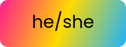
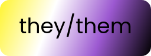

# Pronoun badge generator

A little web app to generate pronoun badges using pride flag colours!

## Examples






## Adding new flags

Source the colour values of the flag, eg. for the trans flag, the values are
```json
[
    "#55cdfc",
    "#f7a8b8",
    "#ffffff",
    "#f7a8b8",
    "#55cdfc"
]
```

You need to add these to a new array in `components/BadgeView.tsx`, and then add a corresponding entry to the `FLAGS` object in the same file.

Please keep the arrays and contents of the `FLAGS` object in alphabetical order to keep things organised.

## Future ideas

- [ ] Make the rendering SVG based to allow for scaling the generated image up with no quality loss. It currently uses a HTML canvas to draw the image, mostly as a learning experience for myself, but that uses bitmap graphics and currently only generates a 256x96 image.
